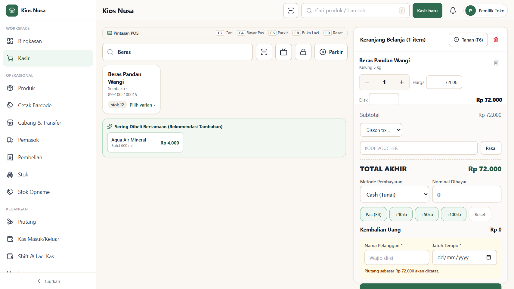
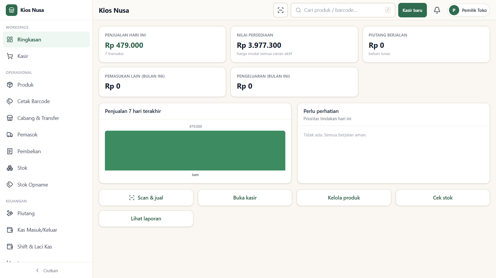
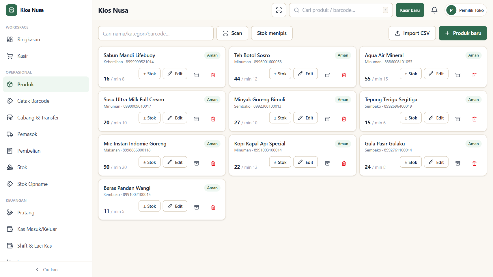
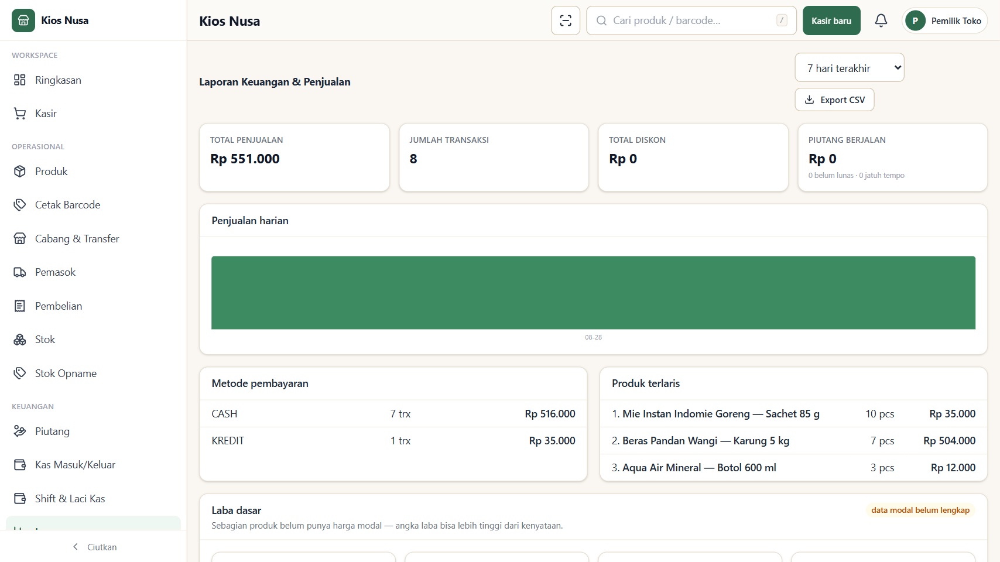
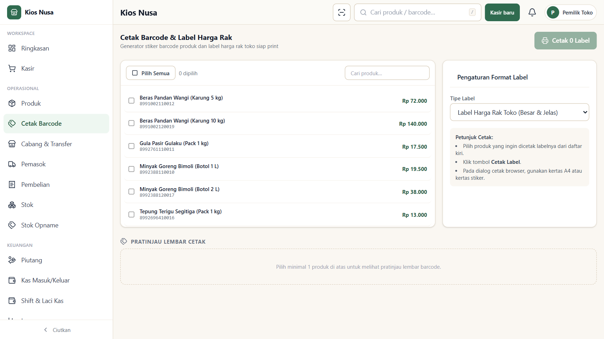
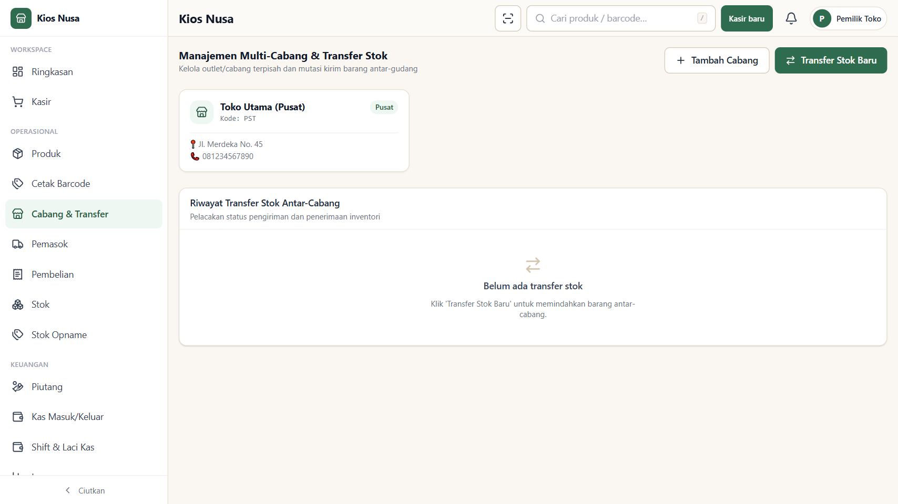
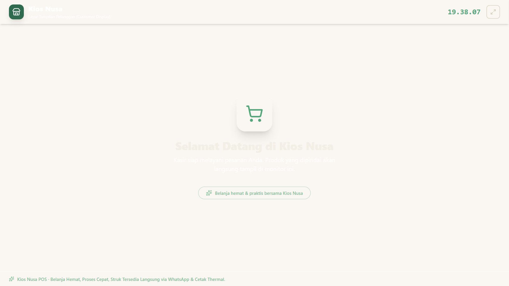
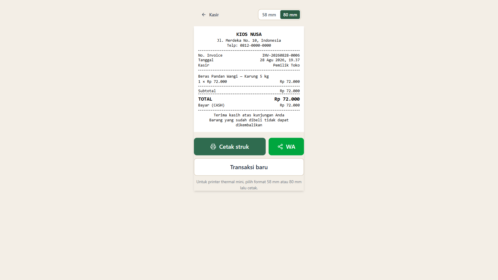

# Kios Nusa — Modern POS & Retail Management System

[](https://www.typescriptlang.org/)
[](https://react.dev/)
[](https://vitejs.dev/)
[](https://sqlite.org/)
[](https://orm.drizzle.team/)
[](https://tailwindcss.com/)
[](https://opensource.org/licenses/MIT)

Aplikasi Point of Sale (POS) dan manajemen operasional toko retail berbasis web & PWA. Dirancang dengan arsitektur **embedded SQLite (zero-config database)**, antarmuka responsif mobile-first, dan alur kerja kasir berkecepatan tinggi tanpa dependensi layanan eksternal yang rumit.

---

## Cuplikan Antarmuka (Showcase)

### 1. Terminal Kasir (POS) & Transaksi Cepat
Layar kasir dengan pencarian instan produk, scan barcode kamera, pemilihan varian, harga grosir bertingkat, dan tahan/parkir keranjang.


### 2. Dashboard Ikhtisar Bisnis
Ringkasan omset harian, laba kotor, volume transaksi, notifikasi stok menipis, dan grafik performa toko.


### 3. Katalog & Manajemen Inventori
Pengaturan multi-varian produk, harga beli/jual, pelacakan batch kadaluarsa (*expiry tracking*), dan riwayat mutasi stok.


### 4. Laporan Keuangan & Analitik Penjualan
Rekapitulasi penjualan berdasarkan metode bayar (Tunai, QRIS, Debit, Kredit/Piutang), produk terlaris, dan ekspor data ke CSV.


### 5. Cetak Barcode & Label Harga Rak
Generator stiker barcode produk dan label harga rak (*shelf tags*) siap cetak dalam berbagai format kertas/printer.


### 6. Multi-Cabang & Mutasi Antar-Outlet
Manajemen toko cabang, gudang utama, pembuatan surat jalan, dan approval transfer barang antar-lokasi.


### 7. Layar Pelanggan (Customer Facing Display)
Layar monitor kedua untuk pelanggan yang tersinkronisasi real-time via `BroadcastChannel` (`/display`) lengkap dengan QRIS dinamis.


### 8. Struk Thermal & WhatsApp Receipt
Format cetak struk kompatibel printer thermal 58mm / 80mm dan generator teks struk instan untuk dikirim via WhatsApp.


---

## Modul & Kemampuan Utama

| Modul | Kemampuan Teknis |
|---|---|
| **POS & Checkout** | Pencarian instan (nama/SKU/barcode), scanner kamera bawaan via `BarcodeDetector API`, keyboard shortcuts (`/` cari, `F2` bayar), multi metode bayar (Tunai, QRIS, Debit, Piutang). |
| **Harga & Promosi** | Harga grosir otomatis berdasarkan kuantitas beli (*tier pricing*), diskon manual / voucher persentase & nominal. |
| **Keranjang & Pesanan** | Fitur *Hold / Parkir Keranjang* untuk melayani pelanggan lain tanpa membatalkan transaksi berjalan. |
| **Customer Display** | Sub-aplikasi `/display` tanpa server websocket tambahan, sinkronisasi state keranjang & total belanja via browser `BroadcastChannel`. |
| **Shift Kasir** | Buka kasir dengan modal awal, rekapitulasi penjualan per kasir, dan validasi selisih uang fisik laci kas (*cash diff*). |
| **Inventori & Batch** | Pelacakan masa kadaluarsa (peringatan batch < 60 hari), rekomendasi *Auto-Reorder* berbasis kecepatan jual 7 hari, dan formulir Stock Opname. |
| **Multi-Cabang** | Isolasi stok per outlet / gudang, pencatatan mutasi kirim & terima barang antar-cabang. |
| **Hardware POS** | Dukungan perintah pembuka laci kas otomatis (*ESC/POS Drawer Kick* `ESC p 0 25 250`) & cetak struk standar 58mm/80mm. |
| **Keuangan Toko** | Buku kas operasional (pemasukan & pengeluaran harian), kartu piutang pelanggan, dan pencatatan riwayat cicilan pelunasan. |
| **Data & Backup** | Import katalog massal dari CSV, export laporan ke spreadsheet, serta 1-klik snapshot database SQLite ke folder `backups/`. |

---

## Arsitektur & Teknologi

- **Frontend**: React 19, TypeScript, TailwindCSS v4, Wouter (Routing ringan), Lucide Icons, Radix UI Primitives.
- **Backend API**: Node.js, Express, tRPC / REST endpoints, Jose (JWT authentication stateless).
- **Database & Storage**: SQLite via `@libsql/client` (single file `kios_nusa.db`, zero external database daemon), Drizzle ORM.
- **Testing & Tooling**: Vitest (Unit & Integration tests), Playwright (E2E browser automation), Vite 7.

---

## Panduan Instalasi & Menjalankan Lokal

### Prasyarat
- **Node.js** versi ≥ 20.x
- **pnpm** (direkomendasikan) atau `npm`

### Langkah Setup

```bash
# 1. Clone repositori
git clone https://github.com/Binis-code/kasir-sederhana.git
cd kasir-sederhana

# 2. Pasang dependensi
pnpm install

# 3. Buat file environment
cp .env.example .env

# 4. Generate skema database & masukkan data awal (seeding)
pnpm db:push
pnpm db:seed

# 5. Jalankan server development
pnpm dev
```

Aplikasi web dapat langsung diakses di:
- **Aplikasi Kasir & Admin:** `http://localhost:5173`
- **Customer Facing Display:** `http://localhost:5173/display`

---

## Akun Default (Hasil Seeding)

| Peran | Username | Password Default | Akses |
|---|---|---|---|
| **Owner** | `owner` | `KiosNusa!Owner26` | Akses penuh seluruh modul toko, master data, dan laporan keuangan |
| **Admin** | `admin` | `admin123` | Manajemen produk, inventori, pembelian, dan laporan |
| **Kasir** | `kasir` | `kasir123` | Terminal transaksi POS, buka/tutup shift, dan cetak struk |

---

## Perintah Pengujian & Verifikasi

```bash
# Menjalankan unit & integration tests
pnpm test

# Menjalankan static type checking
pnpm check

# Menjalankan visual smoke & browser automated checks
node scripts/shoot.mjs
```

---

## Lisensi

Didistribusikan di bawah lisensi [MIT](LICENSE).
